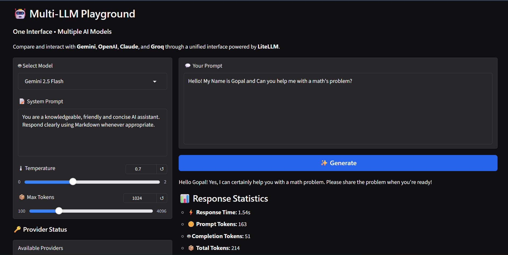
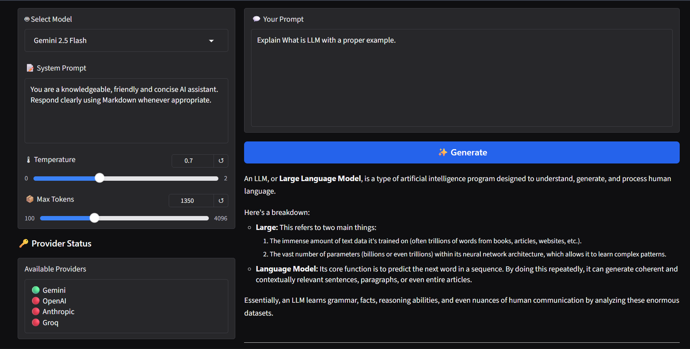

# 🤖 Multi-LLM Playground

A simple yet powerful Gradio application that lets you interact with multiple Large Language Models (LLMs) through a single interface using LiteLLM.

This project demonstrates how to build an LLM-powered application that supports multiple AI providers, configurable prompts, conversation memory, and response statistics.

---

## 🚀 Features

- 🤖 Multiple LLM Support
  - Gemini
  - OpenAI
  - Anthropic (Claude)
  - Groq Compatible Models

- 📝 Custom System Prompt

- 🌡 Adjustable Temperature

- 📦 Configurable Max Tokens

- 💬 Conversation Memory
  - Maintains chat history during the current session.

- 📊 Response Statistics
  - Response Time
  - Prompt Tokens
  - Completion Tokens
  - Total Tokens
  - Estimated Cost (when supported)

- 🔑 Provider Status
  - Displays which API keys are configured.

- 🗑 Clear Chat
  - Clears the current conversation while keeping the application ready for a new session.

---

## 📸 Screenshots

### Main Interface



---



---

## 🛠 Tech Stack

- Python
- Gradio
- LiteLLM
- Google Gemini API
- OpenAI API
- Anthropic API
- Groq API

---

## 📂 Project Structure

```
Multi-LLM-Playground/
│
├── app.py
├── llm.py
├── config.py
├── requirements.txt
├── .env.example
├── README.md
└── screenshots/
```

---

## ⚙ Installation

### 1. Clone the repository

```bash
git clone https://github.com/gopalthakare/Multi-LLM-Playground.git

cd Multi-LLM-Playground
```

### 2. Create a virtual environment

```bash
python -m venv venv
```

Activate it

Windows

```bash
venv\Scripts\activate
```

Linux / macOS

```bash
source venv/bin/activate
```

### 3. Install dependencies

```bash
pip install -r requirements.txt
```

### 4. Configure API Keys

Create a `.env` file in the project root.

Example:

```env
GEMINI_API_KEY=your_api_key_here

OPENAI_API_KEY=

ANTHROPIC_API_KEY=

GROQ_API_KEY=
```

Only the providers with configured API keys will be available.

---

## ▶ Running the Project

```bash
python app.py
```

Open the local Gradio URL shown in the terminal.

---

## 📖 How It Works

1. Select an LLM.
2. Configure the system prompt.
3. Adjust temperature and max tokens if needed.
4. Enter your prompt.
5. View the generated response along with response statistics.
6. Continue the conversation using the built-in session memory.

---

## 🎯 Learning Goals

This project was built to practice:

- Working with multiple LLM providers
- LiteLLM integration
- Prompt Engineering
- Gradio UI development
- Conversation state management
- Environment variable handling
- API integration

---

## 🔮 Future Improvements

- Streaming responses
- Support for image models
- File upload support
- Model comparison mode
- Chat export feature

---

## 👨‍💻 Author

### Gopal Thakare

Python Developer | AI & Automation Enthusiast

- LinkedIn: https://www.linkedin.com/in/gopalthakare14/
- GitHub: https://github.com/gopalthakare

---

## 📄 License

This project is licensed under the MIT License - see [LICENSE](LICENSE) file for details.